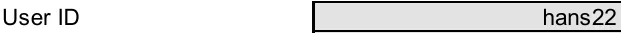
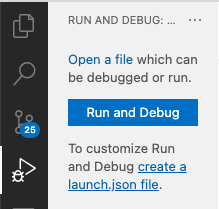
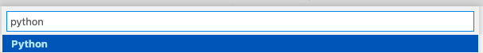
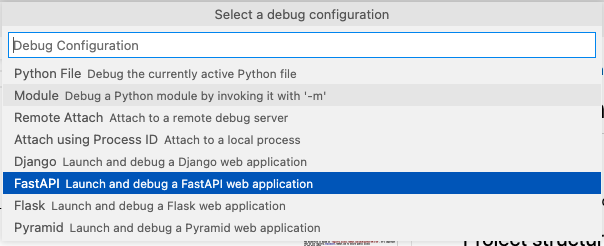
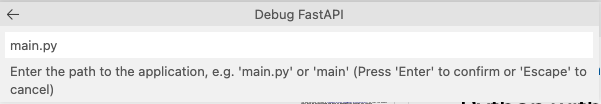
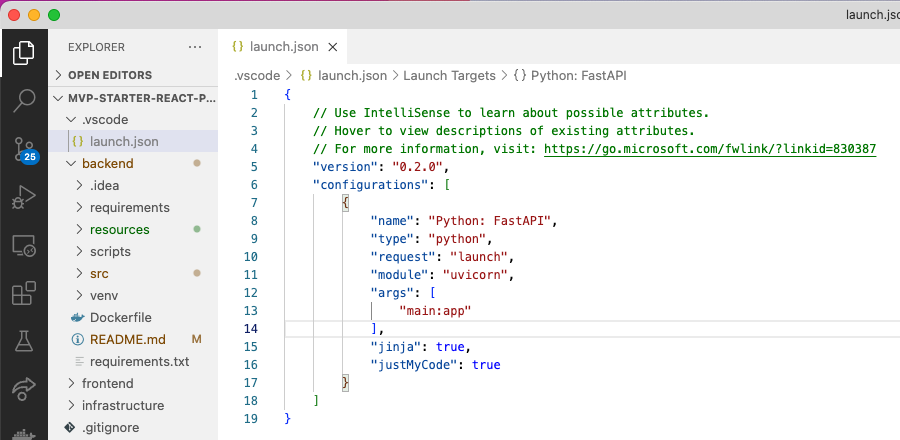

# DAESY-ADP-Service

_Maintainers: Lorena Mendez, Felix Pahlke_

## Overview

The DAESY-ADP-Service is a microservice that simplifies the work with the ADP-API and adds extra functionalities to it. Just add it to your OpenShift project and use it to get respones from ADP.

The Main use-case would be to return an easy to understand, preprocessed array of the extracted attributes, as well as add small "validation images" to the ADP Response.

### Example:

ADP extracts: `UserID = hans22`

Added validation image (_Choose between Key-Value-, Value- and Key-Image_):



The pictures will be converted to base64 strings and simply added to the JSON response, which also contains all other information about the extracted attributes. You can also set a padding for the images via the query-parameters of the API. The pictures are converted to webp by default, ensuring a very small file size.

# Get Started

This project uses a simplified version of the [ClientEngineering Fast API Backend Template](https://github.ibm.com/technology-garage-dach/python-fastapi) as the base template. For further Information take a look at that repository.

# Run in VSCode

## Setup python virtual environment

Open `daesy-adp-service` directory with **VSCode**.

Create virutal environment in folder `venv`:

```
python -m venv venv
```

Activate your environment

```
source venv/bin/activate
```

To double check the change, open **View>View windows>Terminal**, type:

```
which python
```

## Install dependencies

In the `Backend` root folder, run:

```
pip install -r requirements.txt
```

## Add configuration in `vscode/launch.json`

Click on **Run and Debug** on the **Primary Side Bar** on the left of **VSCode**, then on **create a launch.json file**.


Choose `python`:



Choose `FastAPI`:



Add `main.py` file as entrance of the program (you might need to change `"args": ["app.main:app"]` in your launch.json):



As result you get a `vscode/launch.json` file. Here we can add customized attributes.


Here is an example for `launch.json` . Set the args "--reload" to enable hot reloading and "--port=4000" to set your port:

```json
{
  "version": "0.2.0",
  "configurations": [
    {
      "name": "Python: FastAPI",
      "type": "python",
      "request": "launch",
      "module": "uvicorn",
      "args": ["app.main:app", "--reload", "--port=4000"],
      "jinja": true,
      "justMyCode": true,
      "env": {
        "ADP_PROJECT_ID": "XXX",
        "ADP_URL": "XXX",
        "ADP_USERNAME": "XXX",
        "ADP_PASSWORD": "XXX"
      }
    }
  ]
}
```

You can now click "play" in the Run&Debug Section to start the service.

Thats it, check Swagger UI with:

```
http://localhost:4000/api/docs
```

# Run with docker

Start a terminal in the `daesy-adp-service` folder and ensure docker engine is up and running.

## Build with Docker

You can start a local Docker build with:

```
docker build -t daesy-adp-service .
```

This will install all dependencies within the created image.

## Run with docker

You need to provide environtment variables (e.g. for connectiong a database USER=admin etc.) you can create a plain .env file with parameters and pass it to docker:

```
docker run --env-file .env --rm -it -p 4000:4000   daesy-adp-service
```

Your .env file should look like this:

```
ADP_PROJECT_ID=XXXXX
ADP_URL=XXXXX
ADP_USERNAME=XXXX
ADP_PASSWORD=XXXX
```

Thats it, check Swagger UI with:

```
http://localhost:4000/api/docs
```
